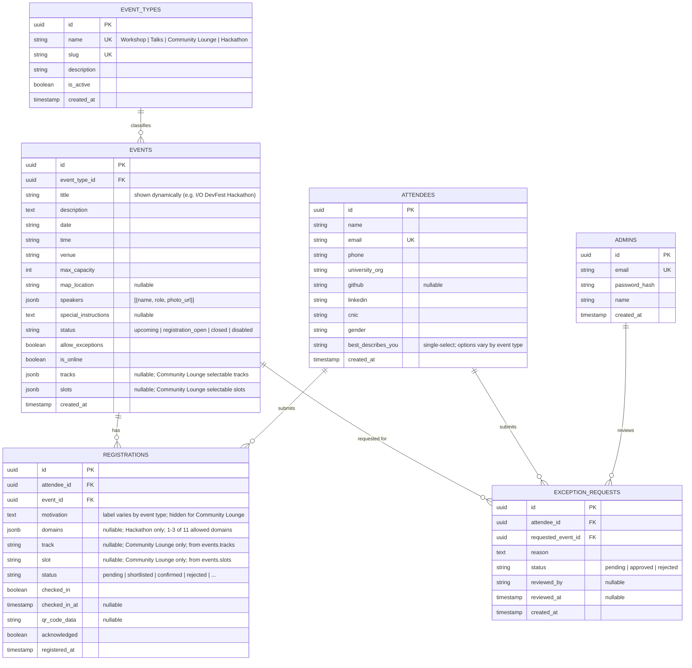

# Registration System — Redesigned ERD

This is the target data model for extending the registration system to support
multiple **event types** (Workshop, Talks, Community Lounge, Hackathon) with a
**dynamic registration form** whose fields depend on the event's type.

## Entity-Relationship Diagram

## Dynamic registration form by event type

| Field | Workshop | Talks | Community Lounge | Hackathon |
|---|---|---|---|---|
| name, email, phone, university/org, linkedin, github, cnic, gender | ✓ | ✓ | ✓ | ✓ |
| "What best describes you?" — single-select | 6-item list | 6-item list | 6-item list | 15-item list |
| Domains — multi-select, **max 3** (11 options) | — | — | — | ✓ |
| Track — single-select from `events.tracks` | — | — | ✓ | — |
| Slot — single-select from `events.slots` | — | — | ✓ | — |
| Motivation textarea | "Why do you want to attend this workshop?" | "Why do you want to attend this talk?" | hidden | "How will you contribute to solving problems in the Hackathon?" |

### "What best describes you?" — option sets

**Default (Workshop / Talks / Community Lounge)** — single-select:
Student · Young Professional · Intermediate Expert · Senior Expert · Freelancer · Other

**Hackathon** — single-select:
Student · Web Developer · Mobile App Developer · Software Developer · Full Stack Developer · Game Developer · Other Developer · UI/UX Designer · Product Designer · Game Designer · Other Designer · SQA Engineer/Tester · Software Sales Executive · Freelancer · Others

### Domains (Hackathon) — multi-select, max 3

1. Service & Software Solutions
2. Fintech & Digital Economy
3. Healthcare, EdTech & Skill Development
4. Logistics, Retail & E-commerce
5. Infrastructure, Smart City & Government Systems
6. Water, Energy & Waste Management
7. Social Impact, Accessibility & Inclusion
8. Environment & Climate Change Solutions
9. Cybersecurity & Digital Safety
10. AI, Automation & Emerging Technologies
11. SME & Startup Enablement

## Changes vs. current schema

| Current | New |
|---|---|
| `workshops` table | renamed to `events`; gains `event_type_id`, `tracks`, `slots` |
| `registrations.workshop_id` | `registrations.event_id` |
| `exception_requests.requested_workshop_id` | `exception_requests.requested_event_id` |
| `attendees.defines_you_best` | renamed `attendees.best_describes_you` (label "What best describes you?") |
| — | new `event_types` table, seeded with the 4 types (admin CRUD) |
| — | `registrations.domains` (jsonb, nullable, Hackathon) |
| — | `registrations.track`, `registrations.slot` (nullable, Community Lounge) |

Migration backfills existing `workshops` rows as event type **Workshop**.

> Teams / project submissions are intentionally **not** part of this model.
